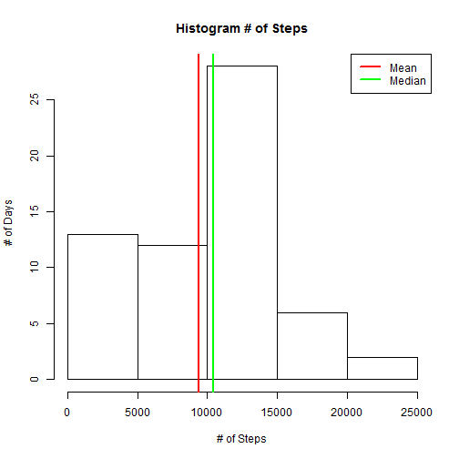
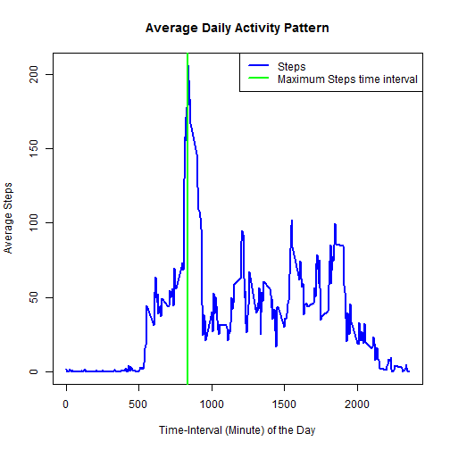
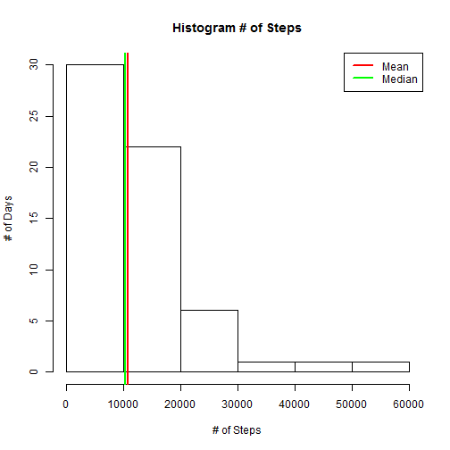
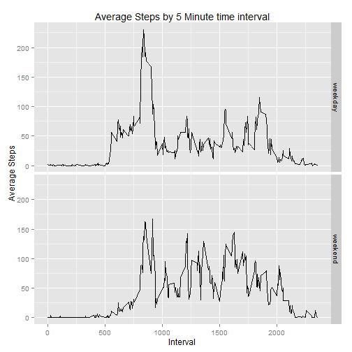

# Reproducible Research


## Report submitted towards Assignment 01

###Part 01: Environment Setup
Getting the environment ready with required packages

```r
# Assuming the packages are already installed
library(ggplot2)
library(tidyr)
library(lubridate)
library(dplyr)
library(knitr)
```


###Part 02: Loading and preprocessing the data
Load the data off the csv file and process the fields in desired format

```r
# Assuming the data doesn't needs to be downloaded
# Read the data off the csv file. Change the data frame to data frame table and convert date to POSIXct
data <- read.csv("activity.csv", header = TRUE)
data <- tbl_df(data)
data <- mutate(data, date = as.POSIXct(date))
```

###Part 03: Total number of steps taken per day?
Create aggregation (sum of  Steps by date). Plot it on a graph and reports the mean/median

```r
aggdata <- aggregate(data$steps, by = list(data$date), FUN = sum, na.rm = TRUE)
hist(aggdata$x, xlab = "# of Steps", ylab = "# of Days", main = "Histogram # of Steps")
abline(v = mean(aggdata$x), col = "red", lwd = "2")
abline(v = median(aggdata$x), col = "green", lwd = "2")
legend("topright", c('Mean','Median'),lwd=c(2,2),col=c('red','green'))
```

 

The mean of total number of steps taken per day (red) 9354 and the median (green) is 10395


###Part 04: Average daily activity pattern
Create aggregation (sum of  Steps by time-interval), plot it on a graph and reports the mean/median

```r
minutedata <- aggregate(data$steps, by = list(data$interval), FUN = mean, na.rm = TRUE)
colnames(minutedata) <- c("Grp", "avgSteps")
plot(minutedata$Grp, minutedata$avgSteps, type = 'l', lwd = "2", col = 'blue', xlab = "Time-Interval (Minute) of the Day", ylab = "Average Steps", main = "Average Daily Activity Pattern")
abline(v = minutedata[minutedata$avgSteps == max(minutedata$avgSteps),1], col = "green", lwd = "2")
legend("topright", c('Steps','Maximum Steps time interval'), lwd = c(2,2), col = c('blue','green'))
```

 

The time interval with maxium number of steps is 835

###Part 05: Imputing missing values
There are a total of 17568 missing values in the data. Therefore it is critical to detemine and impute the missing values. The strategy is to replace any missing values with the mean of corresponding 5-minute time interval.


```r
# Create a copy of original data. Convert that to data frame table
data2 <- data
data2 <- tbl_df(data2)
minutedata <- tbl_df(minutedata)

#megre it with the minute data created in earlier step and replicate missing values with corresponsing interval average
data2 <- merge(data2,minutedata, by.x = "interval", by.y = "Grp")
data2 <- mutate(data2, stepsII = ifelse(is.na(steps),avgSteps,steps))

# New aggregation is created using the new dataset (with no missing values) by date and a graph is generated
aggdata2 <- aggregate(data2$stepsII, by = list(data$date), FUN = sum, na.rm = TRUE)
hist(aggdata2$x, xlab = "# of Steps", ylab = "# of Days", main = "Histogram # of Steps")
abline(v = mean(aggdata2$x), col = "red", lwd = "2")
abline(v = median(aggdata2$x), col = "green", lwd = "2")
legend("topright", c('Mean','Median'),lwd=c(2,2),col=c('red','green'))
```

 

The mean of total number of steps taken per day (red) and the median (green)  after imputing the missng values is 10766  and 10351 respectively. The new values (after imputing) have a mean higher by 1412 and median higher by -44 steps.

### Part 06: Differences in activity patterns between weekdays and weekends

```r
# A new variable is created to identfy between the weekday or the weekend
data2 <- mutate(data2, dayofweek = weekdays(date, abbreviate = TRUE))
data2 <- mutate(data2, Wkday = as.factor(ifelse(dayofweek %in% c("Mon","Tue","Wed","Thu","Fri"), "weekday", "weekend")))

# Number of steps are plotted to compare trends between weekend and weekdays steps
minutedata2 <- aggregate(data2$stepsII, by = list(data2$interval, data2$Wkday), FUN = mean, na.rm = TRUE)
colnames(minutedata2) <- c("Interval","Weekday","avgSteps")
qplot(Interval, avgSteps, data = minutedata2, geom = c("line"), facets = Weekday~.)+ggtitle("Average Steps by 5 Minute time interval")+labs(x="Interval",y="Average Steps")
```

 
